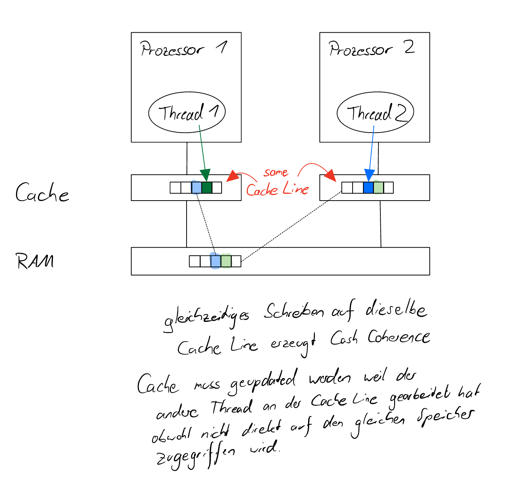

# What is false sharing? Describe it visually by creating your own graphic

# Read the paper There's plenty of room at the Top: What will drive computer perfomance after Moore's law?

## Explain in detail the figure Perfomance gains after Moore's law ends.

Die Abbildung "Perfomance gains after Moore's law ends." beschreibt, wie in der Post-Moore-Ära Verbesserungen der Rechenleistung zunehmend von Technologien an der Oberseite, "the Top", des Computing-Stacks statt von denen an der Unterseite, "the Bottom", kommen werden. Dies stellt eine Umkehrung des historischen Trends dar. "The Top" bezieht sich auf Software, Algorithmen und Hardwarearchitektur, während "the Bottom" sich z.B. auf Halbleitertechnologie bezieht. Die Abbildung betont, dass zukünftige Gewinne bei der Rechenleistung opportunistischer, ungleichmäßiger und sporadischer sein werden und dem Gesetz des abnehmenden Ertrags unterliegen.
