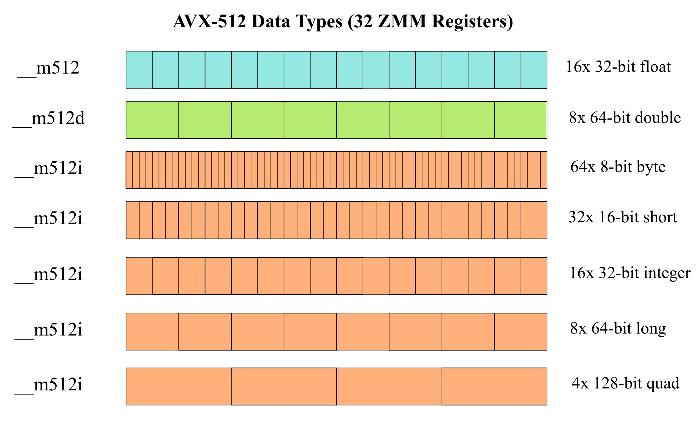

## Explain three vectorization clauses of your choice that can be used with #pragma omp simd.

#### aligned(list[:alignment])
 Diese Klausel gibt an, dass die Objekte in der Liste gemäß der durch "alignment" ausgedrückten Anzahl von Bytes ausgerichtet sind. Dies ist wichtig, da eine korrekte Ausrichtung der Daten die Vektorisierungsleistung verbessern kann, indem Zugriffskonflikte und Cache-Miss-Raten reduziert werden.

#### linear(list[:step])
 Diese Klausel gibt an, dass die Schleifenvariable in der Liste linear ist. Also, dass die Variablen in der Liste eine lineare Beziehung über die Iterationen der Schleife hinweg haben. Das bedeutet, dass die Schleifenvariable in jedem Iterationsschritt um den angegebenen Schritt inkrementiert wird. Dies ist wichtig, da die Schleifenvariable in einer SIMD-Schleife nicht automatisch inkrementiert wird, was zu einem inkonsistenten Verhalten führen kann.

#### reduction(operator: list)
 Diese Klausel führt eine Reduktion auf jeder Datenvariablen in der Liste gemäß dem angegebenen Reduktions-Identifikator durch. Die unterstützten Reduktions-Operatoren umfassen Addition (+), Subtraktion (-), Multiplikation (*), bitweise AND (&), bitweise OR (|), bitweise XOR (^), logisches AND (&&) und logisches OR (||). Dies ermöglicht die effiziente Zusammenfassung von Werten über die Elemente einer Schleife hinweg unter Verwendung von Vektoroperationen.

## On slide 17 is a graphic for SSE data types and how these data types occupy the XMM vector registers, create a similar graphic for AVX512 data types (__m512, __m512d, _m512i), how they occupy ZMM vector registers.

## Read the article [Intel MMX for Multimedia PCs](./242857.242865.pdf). Discuss two things you find particularly interesting.

#### Erweiterung der Prozessorarchitektur
 Die MMX-Technologie führte 57 neue Instruktionen und andere Architekturerweiterungen ein, um die Systemleistung erheblich zu steigern. Diese Erweiterungen zielten darauf ab, die Parallelität in Algorithmen auszunutzen, die häufig in Multimedia- und Kommunikationsanwendungen vorkommen. Die Implementierung einer SIMD Architektur stellt einen grundlegenden Faktor hinter dem Leistungsanstieg der MMX-Technologie dar. Diese Parallelverarbeitng kleiner Datenelemente, wie 8-Bit-Pixel oder 16-Bit-Audiosamples, ermöglicht signifikante Leistungssteigerungen, indem mehr Daten pro Taktzyklus verarbeitet werden können. MMX-Technologie kann beispielsweise für Multimedia-Anwendungen Leistungsgewinne von 50% bis 100% im Vergleich zur Ausführung derselben Anwendungen auf demselben Prozessor ohne die MMX-Technologie erzielen.

#### Kompatibilität mit bestehender Software
 Ein weiterer interessanter Aspekt der MMX-Technologie ist ihr Ansatz, vollständige Rückwärtskompatibilität mit vorhandener Software, einschließlich Betriebsystemen und Anwendungen, zu gewährleisten. Die Kompatibilität war ein zentrales Ziel beim Design der MMX-Erweiterungen und wurde durch die Nutzung der bestehenden Floating-Point-Register des Prozessors für MMX-Daten erreicht. Damit konnten MMX-Instruktionen in vorhandene Intel-Architekturen zu integrieren werden ohne neue Modi oder Zustände einzuführen, die Änderungen am Betriebssystem erfordert hätten. Die MMX-Technologie konnte somit nahtlos in bestehende Systeme integriert werden, wobei sie eine deutliche Leistungssteigerung für Multimedia- und Kommunikationsanwendungen bot, ohne die Kompatibilität zu opfern.

Diese beiden Aspekte zeigen, wie die MMX-Technologie entworfen wurde, um den wachsenden Anforderungen an Multimedia-Leistung in PCs zu begegnen, während gleichzeitig eine reibungslose Integration in bestehende Systeme sichergestellt wurde.